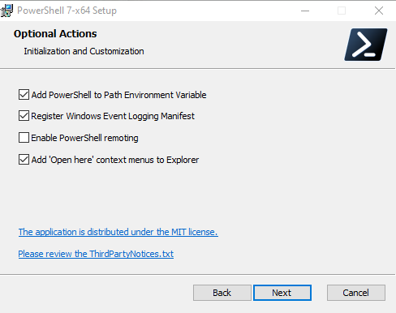
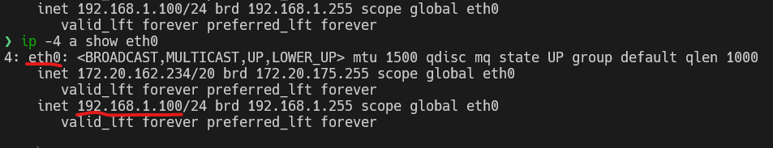

<div dir="rtl">

# چطور تونستم مشکل WSL2 رو حل کنم؟

## قسمت اول راهنمای نصب WSL2


## **لطفا توجه کنید این روش به طور کلی منسوخ شده و روش جدیدی جایگزین آن شده وکه بسیار راحت تر از این روش هست پس برای ورود به آدرس مطلب اصلی بر روی [اینجا کلیک کنید](https://github.com/illustrayking/wslPortForwarding)**

### **مقدمه**

نمیدونم اینجا آیا کسی هست که مثل من دنیای لینوکس رو با طمع مایکروسافت چشیده باشه؟ شاید لینوکس بازهای حرفه ای بگن عجب طمع تلخ و بدمزه ای اصلا چطور میشه توی یک دیس غذای مایکروسافت رو با لینوکس مخلوط کرد این یک توهین بزرگ به تمام مزه های جهان بود

اما من کسی بودم که فقط میگفت david david [microsoft](https://www.microsoft.com) و اصلا هیچ چیزی جز مایکروسافت توی کلش فرو نمیرفت تا اینکه یک روز بچه های ردموند به واقعیت قدرتمندی لینوکس [اعتراف کردن](https://www.zoomit.ir/2020/5/18/348674/microsoft-wrong-open-source-linux/) و این شد که من از معجزه لینوکس و دنیای لینوکس آشنا شدم


امروز میخوام مثل همیشه که وقتی چیزی رو بلد میشم مثل مته توی مخم می افته و تا با کسی به اشتراک نزارم آروم نمیگیرم، مطالبم رو با شما به اشتراک بزارم

دوست دارم در دو قسمت از آسون به کمی سخت حرکت کنم تا دوستان مایکروسافتی از طمع دلنشین لینوکس در ویندوز غافل نمونن

ابتدا مسیر خودم رو با نصب WSL2 شروع میکنم و در نهایت به مسئله و چالش بزرگ حل تنها مشکل آزاردهنده لینوکس بر روی ویندوز میرم تا شما رو هم از شر این مشکل منحوس راحت کنم

### **اصلا WSL یعنی چی؟**

کلمه WSL مخفف `windows subsystem for linux` هست که به شما اجازه میده بتونید بر روی سیستم خودتون طمع لینوکس یا همون اوبونتو رو بچشید

و به همین دلیل به `WSL` معروف هست که در آخرین بیلد ویندوز یعنی 2004 شما میتونید ورژن 2 لینوکس رو داشته باشید

ورژن دوم این WSL کاملا با نسخه اولیه متفاوت هست، در نسخه اولیه یک پرتابل لینوکس بر روی سیستم بود که به شما اجازه دسترسی به همه چیز رو نمیداد و یک چیز ناقص بود. فقط یک حرکت کوچیک از سمت مایکروسافت بود

اما در ورژن دوم همه چیز متفاوت شد حالا شما یک کرنل کامل از لینوکس رو در اختیار دارید و به طرز عجیبی شما یک سیستم عامل رو بر روی ماشین مجازی نصب میکنید اما طمع تلخ ماشین مجازی رو به شما نمیده

همه ما میدونیم که ماشین های مجازی مشکلات متعددی رو در مصرف منابع دارن و از این رو خیلی ها به سمت ماشین مجازی نمیرن اما در WSL2 کاملا همه چیز برعکسه و انگار که نرم افزار ms paint رو بر روی سیستم خودتون ران کردید ( در این حد سبکه)

پس ما فهمیدیم که ورژن دوم `WSL` روی یک ماشین مجازی یا همون `Hyper-v` نصب میشه

بریم با همدیگه شروع به نصب لینوکس کنیم

### **قدم اول چک کنید که ویندوز شما ورژن 2004 باشه**

همه ما میدونیم که WSL2 از بیلد 2004 به بعد فعال میشه 

پس برای اینکار با فشردن کلید های ترکیبی `windows + r` پنجره `Run` رو باز کنید و بنویسید `winver` و اینتر کنید صفحه ای نمایان میشود و باید چیزی شبیه به ورژن پایین باشد


اگر اینطور نیست سریعا اقدام به آپدیت دستگاه کنید که از طریق windows update اینکار قابل انجام هست

اگر هم میخواهید بدونید چه تعییراتی در این ورژن وجود داشته به [این لینک ](https://www.neowin.net/news/windows-10-version-2004-is-coming---heres-what-you-need-to-know-about-it/)  برید
### **قدم دوم تغییر نام host name ویندوز**

لینوکس همیشه برای ارتباط با دستگاه دیگه از یک host name استفاده میکنه و حتی اون رو بر روی ترمینال شما پرینت میگیره به همین دلیل WSL از نام ویندوز استفاده میکنه

پس ابتدا وارد بخش زیر بشید و یک نام کاملا unique که در هیچ دیوایس دیگه ای استفاده نکردید رو به سیستم خودتون بدید و در نهایت از شما میخواد که سیستم رو ری استارت کنید

**اما شما اینکار رو نمیکنید**

پنجره `run` رو باز کنید (برای اینکار از کلید ترکیبی `windows + r` استفاده کنید)

و حالا تایپ کنید `sysdm.cpl` و پنجره ای ظاهر میشه وارد تب computer name شوید و بر روی دکمه change که پایین سمت راست هست کلید کنید دوباره پنجره ای باز میشه در بخش computer name نام مورد نظر خودتون رو وارد کنید

> هیچ وقت یادتون نره که نامی رو که برای کامپیوتر خودتون انتخاب میکنید یک نام کاملا unique باید باشه و در هیچ دیوایس دیگه ای استفاده نکرده باشید


وقتی به شما اخطار ری استارت کردن رو داد به هیچ عنوان ری استارت نکنید تا مرحله بعد رو هم به اتمام برسونیم اما پنجره اخطار ری استارت رو نبندید بلکه نیازش داریم

### **قدم سوم فعال سازی feature های ویندوز**

اینجا مهم ترین بخش نصب هست 

ابتدا وارد search بشید و تایپ کنید `features` و برای شما یک آیکون همراه با نامی `turn windows features on or off` میاره بر روی اون کلیک کنید تا صفحه کوچکی نمایان شود

سپس گزینه هایی که در زیر هست رو پیدا کنید و تیک بزنید

<div dir="ltr">

```
Hyper-V
    Hyper-V Management Tools
    Hyper-V Platform

Virtual Machine Platform

Windows Subsystem for Linux
```
</div>

در هنگامی که تیک Hyper-v رو میزنید اون رو از حالت collapse با کلیک کردن بر روی + خارج کنید و زیر مجموعه های اون رو هم تیک بزنید

و بعد از اون حالا وقت **ری استارت** فرا رسیده است

پس ری استارت کرده و بگذارید ماشین شما تمام تغییرات رو ثبت کنه

### **قدم چهارم نصب پیش نیازها**

برای اینکه بتونیم محیط ترمینال Ubuntu رو داشته باشیم و اینکه در قسمت های بعدی که میخواهیم چیزهایی رو اضافه کنیم در همین بخش به دانلود تمامی پیش نیازها میپردازیم

> توجه داشته باشید که هر چیزی رو که دانلود میکنید رو نصب نکنید تا زمانی که وقتش برسه و خودم در مطلب اشاره میکنم

بعضی از سیستم ها نیازمند این هست که کرنل wsl رو به صورت دستی آپدیت کنیم تا پذیرای WSL2 بشه

پس این فایل رو دانلود کنید 

#### [WSL2_Kernel](https://wslstorestorage.blob.core.windows.net/wslblob/wsl_update_x64.msi)

برای فصل بعدی که بسیار مهم هست نیازمند نصب `powershell 7.0` هستیم

#### [Powershell_7.0](https://github.com/PowerShell/powershell/releases)

> برای اینکه Powershell رو دانلود کنیم کافی هست که بریم به بخش Assests و بر روی اون فایلی که آخرین ورژن هست و با فرمت .msi هست کلیک کنیم به طور مثال PowerShell-7.0.2-win-x64.msi

و حالا وارد استور میشیم و به نصب دو چیز میپردازیم 

<div dir="ltr">

1- Ubuntu 20.04 LTS

2- Windows Terminal
</div>

که هر دوی اینها درون استور مهیا هستند و فقط کافی هست که شما اونها رو نصب کنید


خب حالا ما دو فایل نصبی و یک اوبونتو و یک ویندوز ترمینال رو در اختیار داریم حالا وقت این هست که وارد بخش نصب اولیه بشیم

### **قدم پنجم تبدیل WSL به WSL2**

ابتدا ubuntu یی که بر روی سیستم نصب کردیم رو ران میکنیم سپس پنجره ای شبیه به `CMD` ران میشود و بر روی اون اخطاری نوشته شده است از اینکه بگذارید سیستم نصب اولیه اوبونتو رو خودش انجام بده پس سیستم رو به حال خودش رها میکنیم تا زمانی که صفحه مورد نظر از ما درخواست وارد کردن نام کاربری و پسورد کنه

یعنی به این شکل

<div dir="ltr">

```
Enter UNIX username: 

Enter UNIX password:
```
</div>

این رو برای اونهایی مینویسم که تا بحال با محیط لینوکس آشنا نیستن 

اول اینکه یوزرنیم خیلی مهمه پس چیزی رو انتخاب کنید که unique باشه و دوم اینکه پسورد رو یک جا بنویسید چرا که در هر مرحله از کار از شما درخواست وارد کردن پسورد میکنه پس فراموش کردنش عملا همه کارها رو میریزونه بهم

> و در نهایت هنگام تایپ پسورد شما هیچ چیزی رو نمیبینید درون ترمینال چاپ شود حتی شما *** همچین شکلی رو هم نمیبینید پس فکر نکنید که کیبورد مشکلی داره یا ترمینال بلکه این حالت  لینوکس هست پس به تایپ خودتون ادامه بدید


خب اگر همه چیز به درستی جلو رفته باشه باید شما `shell prompt` رو ببینید یعنی به این شکل

<div dir="ltr">

```
yourUserName@yourComputerName:~

chris@awesomePc:~

illustray@jumboKing:~
```
</div>

حالا وقت اون رسیده که وارد بحث این بشیم که WSL خودمون رو به ورژن 2 ببریم

روی استارت کلیک راست کنید و بر روی `windows Powershell (Admin)` کلیک کنید

سپس دستور زیر را وارد کنید 

<div dir="ltr">

```
wsl -l -v
```
</div>

با این دستور متوجه میشیم که ورژن و نام اوبونتو نصب شده بر روی سیستم چی هست

پس خروجی به این شکل میشود

<div dir="ltr">

```
  NAME            STATE           VERSION
* Ubuntu-20.04    Running         1
```
</div>

خب حالا که نام اوبونتو رو میدونیم و میبینم که ورژن ما هنوز 1 هست اون رو تغییر میدیم به ورژن 2 با دستور زیر

<div dir="ltr">

```
wsl --set-version Ubuntu-20.04 2
```
</div>

خب ابتدا از دستور WSL استفاده میکنیم و از option `--set-version` برای تغییر ورژن استفاده میکنیم سپس نام توزیعی رو که توسط دستور قبل پرینت گرفتیم رو مینویسم و با زدن یک اسپس عدد 2 رو چاپ میکنیم که اینطوری من میگم که این توزیع رو وارد ورژن 2 کن

اما ممکنه همون لحظه به شما اروری بده مبنی بر اینکه ابتدا باید kernel رو آپدیت کنید چیزی شبیه به ارور زیر

<div dir="ltr">

```
WSL2 requires an update to its kernel component. for more ......
```
</div>

اگر همچین اروری رو داد اقدام به نصب فایلی میکنیم که در موضوع قبل اون رو دانلود کردیم یعنی [WSL2 Kernel](#WSL2_Kernel) و سپس اقدام دوباره به اجرا دستور قبل میکنیم

هنگام نصب هیچ کاری نباید انجام داد ممکن هست حدود 10 الی 15 دقیقه طول بکشه که کارش رو تموم کنه و شایدم خیلی زودتر اما صبور باشید

## قسمت دوم حل مشکل WSL2

### مقدمه قسمت دوم

خب رسیدیم به مهم ترین بخش لینوکس یعنی حل مشکلی که بخاطرش `issue` های متفاوتی باز شده و هنوز هم در مورد این مشکل صحبت میشه

دوستان لطفا نرم افزار `windows terminal` رو باز کنید و بر روی فلشی که به سمت پایین هست کلیک کنید که منویی نمایش داده میشود در اون بخش بر روی اوبونتو کلیک کنید تا ابونتو ران شود


سپس دستور زیر رو تایپ کنید

<div dir="ltr">

```
ip -4 a | grep '172.'
```
</div>

برای شما محتوایی شبیه به این شکل پرینت میگیره 

<div dir="ltr">

```
    inet 172.20.175.208/20 brd 172.20.175.255 scope global eth0
```
</div>

خب این مشکل بزرگ ما هست این همون چیزی هست که سرش دعوا هستش

متاسفانه به علت اینکه اوبونتو بر روی ماشین مجازی نصب هست تمام رد و بدل های این ماشین `internal` هست و چیزی به نام خروج وجود نداره شما میتونید با ویندوز ارتباط داشته باشید اما کسی و یا دیوایسی از بیرون نمیتونه با شما ارتباط داشته باشه 

بر روی سرچ ویندوز کلیک کنید و عبارت `hyper-v manager` رو تایپ کنید و بر روی اون کلیک کنید 

صفحه ای نمایان میشود که سمت راست این صفحه گزینه ای به نام `Virtual Switch Manager` وجود دارد بر روی آن کلیک کنید و صفحه ای نمایان میشود


کافی هست که به بخش `WSL` بریم میبینیم که WSL در حالت internal هست یعنی اینکه چیزی به نام ارتباط با محیط خارج از ویندوز و یا با دیوایس دیگه وجود نداره


خب الان به خودتون میگید کاری نداره من میبرش روی حالت `external` و تمام!! 

اما مشکل از اینجا شروع میشه که به محض اینکه شما کانکشن ویندوز رو به اوبونتو میدید و بعد که کارتون به اصطلاح تموم میشه و یا دلتون میخواد سیستم رو ری استارت کنید فاجعه رخ میده

به اصطلاح ویندوز، سیستم عامل `aggresive` میشه و همه چیزو بهم میریزه و ناگهان وقتی سیستم رو دوباره روشن میکنید میبینید که کانکشن شما این شکلی شده و اصلا نه در ویندوز و نه در اوبونتو کانکشنی با دنیای اینترنت ندارید و همه چیز بهم ریخته


خب بریم جای دیگه ای رو هم نگاه کنیم

به محض اینکه شما اوبونتو رو ران میکنید خود اوبنتو برای شما یک کانکشن به نام `vEthernet WSL` رو میسازه 

یعنی شما در بخش کانکشن های خودتون یک Ethernet یا wireless Ethernet دارید و دو تا کانکش دیگه که یکی مختص ماشین مجازی و دیگری مختص اوبونتو هست و این کانکشن از کلاس `B` استفاده میکنه و هیچ اجازه ای به شما نمیده که از طریق خارج از دیوایس و یا حتی خارج از محیط network دسترسی داشته باشید


خب داریم دیگه به آخر تور خودمون میرسیم 

کسانی که لینوکسی هستند میدونن که تمام DNS های اونها درون یک فایل به نام `resolv.conf` ثبت میشه

توی WSL مشکلی که وجود داره این هست که به محض اینکه شما ری استارت کنید بعلاوه اینکه تمام تنظیمات ریست میشه این فایل هم دوباره دستخوش تغییر میشه و به حالت اول بر میگرده یعنی عملا با بستن اوبونتو همه تغییرات از تغییر آی پی تا تغییر دی ان اس پاک میشه میره

درون اوبونتو دستور زیر رو تایپ کنید

<div dir="ltr">

```
cat /etc/resolv.conf
```
</div>

خب مقداری که برای شما پرینت میگیره به این شکل هست

<div dir="ltr">

```
# This file was automatically generated by WSL. To stop automatic generation of this file, add the following entry to /etc/wsl.conf:
# [network]
# generateResolvConf = false
nameserver 172.20.160.1
```
</div>

خودش داره میگه که من `automatically generated` هستم درسته که خودش داره بهت میگه که اینکارو بکن که جلوی این حالت رو بگیری اما ماشین توجهی نداره و کار خودش رو میکنه


### **خب ما میخواهیم چه مشکلاتی رو حل کنیم؟**

1- میخواهیم کاری کنیم که WSL دارای آی پی با رنج کلاس `C` یا همون حالت `192.168.1.xxx` باشه

2- دلم میخواد ماشین مجازی من یعنی `WSL` از کانکشن `Ethernet` من هم استفاده کنه برای ارتباط گرفتن

3- دلم میخواد هیچ وقت فایل `resolv.conf` تغییر نکنه و اون چیزی بشه که من مینویسم براش

4- به کانکش ویندوز و اوبونتو دو آی پی جداگانه و `static` بدم و همیشه با اون رنج آی پی ها کار خودش رو شروع کنه

5- دلم میخواد تمامی این نکاتی رو که در بالا گفتم رو خود ویندوز انجام بده و نه من ( چون همونطوری که گفتم به محض ری استارت و یا خاموش کردن همه چیز ریست میشه و حتی بهتره بگیم بهم میریزه)


### **ایده من برای حل این مشکل**

من برای حل این مشکل از دو بخش کمک میگیرم 

<div dir="ltr">

- Powershell (powershell 7.0)

- windows Terminal
</div>

همونطوری که گفتم نیازمند این هستم که 

1- ویندوز دارای آی پی استاتیک باشه

2- اوبونتو هم دارای آی پی استاتیک باشه

3- بتونم دی ان اس اوبونتو رو تغییر بدم و هیچ تغییری نکنه

4- همه اینکارها رو خود ویندوز انجام بده و نه من و همیشه در حالت اتوماتیک باشه

**خب کانسپت من برای اینکار این هست**

ابتدا توسط `Powershell` به ویندوز میگم بیا کانکشن اصلی ویندوز رو بده به `WSL` خب اینجا شاید از خودتون بپرسید که این که شد همون که، حالا ویندوز بدبخت دیگه هیچ ارتباطی با بیرون نداره

اما یک اتفاق خیلی عجیبی اینجا رخ میده

ویندوز وقتی میبینه که دیگه کانکشنی وجود نداره میاد کانکشن WSL که معروف بود به `vEthernet WSL` رو ماله خودش میکنه و عملا کار ما رو راحت میکنه چرا که فقط این کانکشن نیازمند یک آی پی و دی ان اس هست تا ویندوز رو هم به اینترنت متصل کنه

قدم بعدی میام از طریق اوبونتو کانکشن همونی که آی پی رنجش توی `172` بود رو پیدا میکنم و بهش یک آی پی با رنج `192.168.1.xxx` میدم

سپس میام توی همین اوبونتو کاری میکنم که همیشه اون دی ان اسی که من میخوام رو برای اوبونتو مد نظر بگیره

و تمام اینها رو درون یک فایل `script` مینویسم و به ترمینال خودم میدم که هر بار که من ترمینال رو باز کردم خودش تمام تعریف های بالا ر وانجام بده بدون اینکه من دخالتی توی کار داشته باشم و تنها کاری که من باید بکنم این هست که ذره ای **صبور** باشم


### **قدم اول نصب Powershell 7.0**

در مطلب قبلی ما فایل [Powershell 7.0](#Powershell_7.0) رو دانلود کردیم خب الان وقتش هست که اقدام به نصبش کنیم

نصب بسیار راحتی داره و فقط به این مرحله که در تصویر زیر هست رسیدید تیک هایی که من زدم رو شما هم بزنید




### **قدم دوم Run As Administrator**

تمام کارهایی رو که ما میخواهیم در بستر `powershell` انجام بدهیم باید حتما حتما در قالب `run as administrator` باشه به همین دلیل برای راحتی کار خودمون و اینکه به دردسر نیافتیم اینکار رو انجام دادم

ما `windows terminal` رو نصب کردیم که بتونیم تمام `shell` ها رو در یک جا داشته باشیم از `powershell` گرفته تا `ubuntu terminal` و از همه مهم تر این هست که تمامی کدها قراره درون اوبونتو اجرا بشه

پس **کاری میکنیم که ویندوز همیشه `winmdows terminal` رو در حالت `Admin` بالا بیاره**

برای اینکار من از این روش استفاده کردم 

ابتدا درون یک جای مطمئن که خودتون میدونید کلیک راست کرده و از بخش `New` دستور `shortcut` رو اجرا کنید

سپس صفحه ای نمایان میشود و شما میتونید درون این صفحه دستور خودتون و یا نرم افزاری رو که میخواهید از اون shortcut بسازید رو بنویسید

پس مینویسم

<div dir="ltr">

```
pwsh.exe -Command "& Start-Process wt.exe -Verb runAs"
```
</div>


خب با این دستور یک shortcut از `wt.exe` یا همون `windows terminal` ساختم اما اینبار با run as admin

پس دیگه برای ران کردن ترمینال خودم به اونی که ویندوز برای من ساخته کاری ندارم و همیشه از طریق این فایل اوبونتو و یا powershell خودم رو ران میکنم

پس به راحتی اون رو به تسکبار و یا استارت خودتون پین کنید تا هر موقع که خواستید اوبونتو رو بالا بیارید از طریق این shortcut اینکار رو انجام بدید

### **قدم سوم حل مشکل DNS در اوبونتو**

قبل از هر چیزی ازتون میخوام که درون اوبونتو و در هر جایی که میخواهید یک دایرکتوری بسازید، چرا که قراره تمام فایل های خودمون رو درون اون مکان نگهداری کنیم

<div dir="ltr">

```
mkdir /path_to/name_of_directory

for instance

mkdir $HOME/serverConfig
```
</div>

خب حالا درون این دایرکتوری یک فایل متن به نام `resolv.conf` ایجاد میکنیم

<div dir="ltr">

```
cd $HOME/serverConfig && nano resolv.conf
```
</div>

همه ما میدونیم که `nano` یک `text editor` ساده هست که میتونه کار ما رو بسیار راحت کنه پس وقتی این فایل رو توسط nano میسازیم یک صفحه باز میشود که میتونیم مقادیر خودمون رو بنویسیم

پس مینویسیم

<div dir="ltr">

```
nameserver 8.8.8.8
nameserver 8.8.4.4
```
</div>

توسط دستور `nameserver` میتونم دی ان اس های خودم رو برای اوبونتو ثبت کنم پس اگر دی ان اس دیگه ای رو هم میخواهید اضافه کنید میتونید توسط این دستور انجام بدید

سپس کلید ترکیبی `CTRL + x` رو فشار داده و بعد `Y` رو تایپ کرده و اینتر میزنیم برای اینکه مطمئن بشیم مقدارهایی که نوشتیم ثبت شده کافی هست که توسط دستور cat در ترمینال مقدار رو پرینت بگیریم

<div dir="ltr">

```
cat $HOME/serverConfig/resolv.conf

output:

nameserver 8.8.8.8
nameserver 8.8.4.4
```
</div>

### **قدم چهارم تبدیل WSL به External**

خب به یکی از بخش های مهم این کار رسیدیم همونطور که قبلا توضیح دادیم باید کاری کنیم که WSL از آداپتور واقعی استفاده کنه

پس ابتدا در همون مکان `Powershell` خودمون رو باز میکنیم یعنی بر روی اون فلش کلیک کرده و `Powershell` رو انتخاب میکنیم

اولین کاری رو که باید انجام بدیم این هست که نام اون آداپتوری رو که میخواهیم به WSL بدیم رو پیدا کنیم پس دستور زیر رو در Powershell چاپ میکنیم

<div dir="ltr">

```
Get-NetAdapter
```
</div>

و بعد بر روی صفحه مقادیری مانند مقادیر زیر پرینت گرفته میشه


به تصویر بالا دقت کنید، تنها آداپتورهای واقعی سیستم من که یک سخت افزار هستند و دارای gateway یعنی `Wi-Fi` و `Ethernet` هستند

پس یکی از اینها رو برای استفاده درون اوبونتو انتخاب میکنم که انتخاب اول من همون `Ethernet` هست خب الان نام اون رو میدونم یعنی `Ethernet`

> یادتون نره توی Powershell کوچیک بزرگ حرف ها خیلی اهمیت داره پس همونطور که خودش پرینت گرفته مینویسیم

خب حالا دوباره توسط nano  یک فایل درون همون دایرکتوری ایجاد میکنیم به نام `adapter.ps1` یا هر نام دیگه ای که میخواهید ولی فقط آخر این نام باید دارای پسوند `ps1` باشه که یک فایل اسکریپتی powershell رو برای ما ایجاد کنه

<div dir="ltr">

```
nano $HOME/serverConfig/adapter.ps1
```
</div>

و بعد دستور زیر رو درون این فایل مینویسیم و توسط کلید ترکیبی `CTRL + x` و با فشردن کلید `Y` فایل رو سیو میکنیم

<div dir="ltr">

```
Set-VMSwitch WSL -NetAdapterName 'adapter_name'
```
</div>

<div dir="ltr">

```
for example

Set-VMSwitch WSL -NetAdapterName 'Ethernet'

or

Set-VMSwitch WSL -NetAdapterName 'Wi-Fi'
```
</div>

خب این دستور اصلا چی هست؟

توسط این دستور یعنی `Set-VMSwitch` میخواهیم به `WSL` خودمون آداپتور `Ethernet` رو بدیم یا هر آداپتوری که خودتون میخواهید پس همونطور که نام آداپتور رو پیدا کردیم در بخش `adapter_name` مینویسیم

### **قدم پنجم سِت کردن آی پی و دی ان اس Static برای ویندوز**

خب به مرحله یکم سخت کار رسیدیم و باید آستین ها رو بالا بزنیم دستهامون رو تا آرنج توی کد بکنیم

همونطور که قبلا گفتم به محض اینکه شما از ویندوز آداپتور رو میگیرید، ویندوز کانکشن اوبونتو رو برای خودش میکنه که با دادن یک استاتیک آی پی مشکل ما حل میشه

اما من یک مسئله عجیبی رو کشف کردم

هنگامی که من دستگاه رو `restart` میکردم، اوبونتو دو کانکشن به نام های `vEthernet WSL` و `vEthernet WSL 2` ایجاد میکرد و ویندوز اونی رو که دارای `Index` بالاتر باشه رو انتخاب میکنه که در اینجا `vEthernet WSL 2` از همه بالاتر هست

اما هنگامی که من مستقیم سیستم رو `shutdown` میکردم و بعد از مدتی اون رو روشن میکردم خبری از `vEthernet WSL2` نبود

پس اینجا برای من یک چالش ایجاد کرد که باید کدی رو مینوشتم که چک کنه هر وقت `vEthernet WSL 2` بود آی پی استاتیک رو به اون بده و هر وقت `vEthernet WSL` بود آی پی ماله اون بشه

اینجا بود که دید برنامه نویسیم به کارم اومد

ما توی برنامه نویسی دو اندیس داریم به نام های `Logical Operations` یعنی اوپراتورهای منطقی یعنی `&&` و `||` یا همون `and or` توسط اینها یک شرط ایجاد میکنم

کانسپت به این شکل هست

<div dir="ltr">

```
if vEthernet (WSL) 2 exists then assign IP to vEthernet (WSL) 2 else IP is owned by vEthernet (WSL)
```
</div>

در متن بالا گفتم که اگر دومین آداپتور وجود داشت آی پی ماله اون هست اما اگر نبود آی پی در اختیار `vEthernet WSL` هست

پس من میتونم اینکار رو تنها با `||` انجام بدم اگر دومین آداپتور وجود داشته باشه دستور بعد `||` اجرا نمیشه و اگر وجود نداشت میره دستور دوم رو اجرا میکنه

مشکل بعدی که وجود داره این هست که هر دو کانکشن دارای آی پی و بقیه اطلاعات هستند پس باید ابتدا از اونها این مقادیر رو گرفت و به اصطلاح `NIC` رو ببریم توی حالت `DHCP`

پس برای این کار ابتدا درون همون دایرکتوری یک فایل به نام مثلا `ipAdd.ps1` ایجاد میکنیم و سپس دستور زیر رو درون این فایل قرار میدیم

<div dir="ltr">

```
$ethernetName = 'vEthernet (WSL) 2', 'vEthernet (WSL)'

$ip = '192.168.1.104'

$subnet = 24

$gateway = '192.168.1.1'

$dns = '8.8.8.8','8.8.4.4'


((Set-NetIPInterface -InterfaceAlias ${ethernetName}[0] -DHCP Enabled -Confirm:$false && Remove-NetRoute -InterfaceAlias ${ethernetName}[0] -Confirm:$false && 

Set-DnsClientServerAddress -InterfaceAlias ${ethernetName}[0] -ResetServerAddresses) && (Set-NetIPInterface -InterfaceAlias ${ethernetName}[1] -DHCP Enabled -Confirm:$false &

& Remove-NetRoute -InterfaceAlias ${ethernetName}[1] -Confirm:$false && Set-DnsClientServerAddress -InterfaceAlias ${ethernetName}[1] -ResetServerAddresses))


((netsh interface set interface ${$ethernetName}[0] disable && netsh interface set interface ${$ethernetName}[0] enable) && (netsh interface set interface ${$ethernetName}[1] 

disable && netsh interface set interface ${$ethernetName}[1] enable))


((New-NetIPAddress -IPAddress $ip -DefaultGateway $gateway -PrefixLength $subnet -InterfaceAlias ${ethernetName}[0] && Set-DNSClientServerAddress -interfaceAlias $

{ethernetName}[0] -ServerAddresses (${dns}[0], ${dns}[1])) || (New-NetIPAddress -IPAddress $ip -DefaultGateway $gateway -PrefixLength $subnet -InterfaceAlias ${ethernetName}

[1] && Set-DNSClientServerAddress -interfaceAlias ${ethernetName}[1] -ServerAddresses (${dns}[0], ${dns}[1])))

```
</div>

یا روح [دنیس ریچی](https://en.wikipedia.org/wiki/Dennis_Ritchie) این دیگه چی هست!!!


خب قبل از هر چیزی مطمئنا با دیدن این کد حالتون خراب شد مثل من اما به هیچ عنوان نترسید چون همش تکرار هست و فقط دو یا سه دستور داره که باید بدونیم چی هستند و بقیش همش تکراره

این فایل دارای چهار بخش هست

1- ابتدا مقادیرهایی که هی تکرار میشن رو من تبدیل به متغیر کردم یا همون `variable`

2- بخش دوم کارش این هست که کانکشن های من رو یعنی هم `vEthernet WSL` و `vEthernet WSL 2` رو *ریست* کنه

3- بخش سوم کارش این هست که یکبار کانکشن ها رو برای من ری استارت کنه

4- و در نهایت در بخش چهارم کارش این هست که یکی از کانکشن ها مجهز به آی پی و دی ان اس بشن

بریم ذره دره دستورات رو بشکافیم با هم که کمی از ترسش ریخته بشه و بدونیم دقیقا داریم چیکار میکنیم

**دستور اول**

<div dir="ltr">

```
Set-NetIPInterface -InterfaceAlias ${ethernetName}[0] -DHCP Enabled -Confirm:$false
```
</div>

این دستور برای من میاد کانکشن مورد نظر من رو از هر گونه `ip` و `subnetmask` پاک میکنه یا بهتره بگیم که اون رو توی حالت `DHCP Enabled` میبره و برای اینکه از ما سوالی نپرسه از دستور `-Confirm:$false` استفاده میکنیم

و توسط `InterfaceAlias` بهش میگیم کدوم کانکشن رو مدنظرم هست، در اینجا چون من از متغیر دارم استفاده میکنم و متغیر من که همون `ethernetName` هست در حالت `array` هست باید از `interpolation` استفاده کنم (کسانی که `sass` یا `Javascript` کار هستند میدونن این یعنی چی)

**دستور دوم**

<div dir="ltr">

```
Remove-NetRoute -InterfaceAlias ${ethernetName}[0] -Confirm:$false
```
</div>

در بخش دوم به علت اینکه وقتی کانکشن ریست میشه ولی gateway رو پاک نمیکنه مجبور به استفاده دستور `Remove-NetRoute` هستیم

اگر دقت کنید من از `&&` استفاده کردم برای اینکه بگم هر دو باید انجام بشن به شرط اینکه دستور سمت چپ به درستی اجرا شده باشه

**دستور سوم**

<div dir="ltr">

```
Set-DnsClientServerAddress -InterfaceAlias ${ethernetName}[0] -ResetServerAddresses
```
</div>

در بخش سوم میخوام که `DNS` کانکشن مورد نظر رو هم پاک کنه پس توسط این دستور اینکار رو انجام میدم

و سپس همین کار رو دوباره برای یک کانکشن دیگه یعنی `vEthernet WSL` انجام میدم

**دستور چهارم**

<div dir="ltr">

```
netsh interface set interface ${$ethernetName}[0] disable && netsh interface set interface ${$ethernetName}[0] enable
```
</div>

در دستور بعد کانکشن مورد نظرم رو یکبار `disable` و بعد `enabled` کردم چیزی شبیه به همون ری استارت که مطمئن بشم همه چیز پاک شده و به درستی کار میکنه

**دستور پنجم**

<div dir="ltr">

```
New-NetIPAddress -IPAddress $ip -DefaultGateway $gateway -PrefixLength $subnet -InterfaceAlias ${ethernetName}[0]
```
</div>

توسط این دستور یعنی `New-NetIPAddress` به کانکشن مورد نظر خودم `ip,gateway,subnetmask` رو یکجا دادم یعنی چیزی شبیه به تصویر پایین رو درون کانکشن دادم


**دستور ششم**

<div dir="ltr">

```
Set-DNSClientServerAddress -interfaceAlias ${ethernetName}[0] -ServerAddresses (${dns}[0], ${dns}[1])
```
</div>

و سپس در دستور بعدی به Interface مورد نظر خودم که در اینجا `vEthernet WSL 2` هست دی ان اس میدم یعنی همون مقدار متغیر `$dns`

دقیقا معجزه بعد از این دستور اتفاق می افته یعنی وجود `||` یا همون `or` که بهش میگم اگر در دستور اول `vEthernet WSL 2` بود که دیگه دستور بعد `||` رو اجرا نکن یعنی دیگه نیا آی پی بده به `vEthernet WSL` ولی اگر `vEthernet WSL 2` وجود نداشت ( یعنی همون حالت shutdown`) برو توی کار دومین دستور

شما تنها کاری که باید در اینجا انجام بدید این هست که مقدار متغیر های نظیر `ip` و `gateway` رو به اون چیزی که میخواهید تغییر بدید مثلا ممکن هست روتر مورد نظر شما از `192.168.0.1`  استفاده کنه پس به طور مثال به این ترتیب آی پی شما میشه `192.168.0.104`

### **قدم ششم ساخت فایل run.sh برای اتوماتیک کردن تمامی مطالب بالا**

همونطور که گفتم به محض اینکه شما سیستم رو خاموش کنید و یا ری استارت همه چیز بهم میریزه و باید ریست بشه پس عملا شما باید دوباره همه این رفتارها رو انجام بدید که کاریست بسیار سخت و عملا عذاب دهنده

پس به همین دلیل نیازمند ابزاری هستیم که هر وقت اوبونتو اجرا شد، تمام رفتارهای بالا رو خودش اتوماتیک اجرا کنه

مثل powershell اوبونتو هم فایل اسکریپتی میتونه بخونه اما اون فرمتش `sh` هست درون این فایل هر چیزی رو که بنویسیم رو شروع به اجرا میکنه و برای اون مثل یک فایل اسکریپت هست

پس دوباره در همون دایرکتوری که ساختیم یک فایل به نام مثلا `run.sh` میسازیم

درون این فایل مطالبی رو میخواهیم بنویسیم که قدم به قدم جلو میریم

<div dir="ltr">

```
nano $HOME/serverConfig/run.sh
```
</div>

خب فایل ما توسط nano  باز شد و حالا ما میتونیم مطالب خودمون رو بنویسیم

**کاری کنیم که همیشه خودش resolv.conf رو بسازه**:

همونطور که گفتم به محض اینکه شما اوبونتو رو ببندید و یا دوباره باز کنید این فایل از اول ساخته میشه پس باید کاری کنیم که ابتدا فایل رو پاک کنه و اونی رو که من ساختم رو جایگزینش کنه

پس دستور میشه

<div dir="ltr">

```
sudo rm /etc/resolv.conf && sudo cp /path_to/resolv.conf /etc/

for example

sudo rm /etc/resolv.conf && sudo cp $HOME/serverConfig/resolv.conf /etc/
```
</div>

فایل مورد نظر ما یک فایل `config` هست که درون دایرکتوری `etc` می باشد پس ابتدا توسط دستور `rm` اون رو پاک میکنم و بعد توسط دستور بعدی فایل خودم رو جایگزین میکنم همون که در ابتدا ساختیم

**اوبونتو نیازمند آی پی هست چیکار کنیم؟**

خب یک تب دیگه از طریق همون فلش بالایی باز میکنم و درون اوبونتو مینویسم

<div dir="ltr">

```
ip -4 a
```
</div>

توسط این دستور مقداری چاپ میشه، به دنبال آی پی بگردید که شروع رنجش از `172` هست

خب اگر پیدا کردید ببینید اسم کانکشنش چی هست مثلا در تصویر زیر برای من `eth0` هست، پس بخاطر بسپارید


خب بر میگردم به تب قبلی یعنی همون فایل nano  خودم پس مینویسم

<div dir="ltr">

```
sudo rm /etc/resolv.conf && sudo cp /path_to/resolv.conf /etc/

sudo ip a add 192.168.1.xxx/24 brd 192.168.1.255 dev <device_name>

for example

sudo ip a add 192.168.1.100/24 brd 192.168.1.255 dev eth0

for expmaple

sudo ip a add 192.168.0.100/24 brd 192.168.0.255 dev eth0
```
</div>

از دستور `ip` برای اضافه کردن یک آی پی به اوبونتو خودم استفاده کردم سپس آی پی همراه با رنج `24` رو مینویسم و `broadcast` مورد نظرم که همیشه برای رنج آی پی هایی که در بالا نوشتم همین هست پس نیازی به تغییر نیست اگر از رنج `192.168.1` هستید پس میشه `192.168.1.255` و اگر دومی میشه `192.168.0.255` اینها بعلاوه بستگی به subnetmask هم دارن که نیازی نیست وارد جزئیات بشیم

و سپس با دستور `dev` که مخفف `device` هست نام دیوایسی که پیدا کردیم رو میدیم مثلا برای من `eth0` هستش

سپس توسط دستور زیر میگیم که  از چه `router`یی استفاده کنه

مثلا برای من `192.168.1.1` هست که بیشترین روترها در  ایران با این gateway کار میکنن

ابتدا باید `default gateway` خود اوبونتو رو پاک کنیم و سپس اونی رو بدیم که ما میخواهیم

<div dir="ltr">

```
sudo rm /etc/resolv.conf && sudo cp /path_to/resolv.conf /etc/

sudo ip a add 192.168.1.xxx/24 brd 192.168.1.255 dev <device_name>

sudo ip r del default dev <device_name> && sudo ip r add default via <default_gateway> dev <device_name>

for example

sudo ip r del default dev eth0 && sudo ip r add default via 192.168.1.1 dev eth0

or

sudo ip r del default dev eth0 && sudo ip r add default via 192.168.0.1 dev eth0
```
</div>

خب ما الان توسط این دستورات ساده آی پی مورد نظر خودمون رو به اوبونتو دادیم

**چگونه از سرویس at استفاده کنیم**

اصلا `at` چی هست، یک دستور در اوبونتو که به ما اجازه میده که بتونیم دستوری رو به زمان دیگری موکول کنیم مثلا من دلم میخواد دستور مورد نظر من 5 دقیقه دیگه اجرا بشه و یا در روز فلان و در ساعت فلان اجرا بشه

پس برای اینکار ابتدا اقدام به نصب میکنیم

<div dir="ltr">

```
sudo apt install at -y
```
</div>

سپس درون فایل `run.sh` این دستور رو مینویسیم که مطمئن بشیم همیشه این سرویس در زمان استفاده ما ران بشه

پس مینویسیم

<div dir="ltr">

```
sudo rm /etc/resolv.conf && sudo cp /path_to/resolv.conf /etc/

sudo ip a add 192.168.1.xxx/24 brd 192.168.1.255 dev <device_name>

sudo ip r del default dev <device_name> && sudo ip r add default via <default_gateway> dev <device_name>

sudo service atd start
```
</div>

**حالا وقت اون رسیده که فایل های اسکریپت powershell رو هم aut run کنیم**

همونطور که گفتم دلم میخواد هر زمانی که اوبونتو لود شد این اسکریپت ها شروع به فعالیت کنه

خبر خوب این هست که شما میتونید درون لینوکس کدهای powershell رو هم اجرا کنید یعنی به شما اجازه داده میشه که در همون صفحه به powershell سوییچ کنید

اما ما نمیتونیم از پاورشل خود ویندوز استفاده کنیم چرا که دستوراتی رو که من درون اون اسکریپت نوشتم فقط از پاورشل 7 به بعد قابل اجرا هست پس به همین دلیل بود که در بخش قبل به نصب این پاورشل پرداختیم 

پس برای اینکه بتونیم این فایل اسکریپت رو اجرا کنیم یکم باید کثیف کاری کنیم

فایل `powershell 7.0` در دایرکتوری `/mnt/c/Program\ Files/Powershell/7/pwsh.exe` قرار داره پس عملا با نوشتن این دستور پاورشل مورد نظر من اجرا میشه

پس در همون فایل `run.sh` خودمون مینویسیم

<div dir="ltr">

```
sudo rm /etc/resolv.conf && sudo cp /path_to/resolv.conf /etc/

sudo ip a add 192.168.1.xxx/24 brd 192.168.1.255 dev <device_name>

sudo ip r del default dev <device_name> && sudo ip r add default via <default_gateway> dev <device_name>

sudo service atd start

/mnt/c/Program\ Files/Powershell/7/pwsh.exe "\Path_to\adapter.ps1

for example

/mnt/c/Program\ Files/Powershell/7/pwsh.exe "E:\adapter.ps1"
```
</div>

> حتما فایل های با فرمت `ps1` رو به درایوهایی انتقال بدید که Powershell بتونه بهشون دسترسی داشته باشه مثلا برای من الان در درایو E موجود هست و هنگامی که میخواهید به درایو مورد نظر اشاره کنید حتما بزرگ بنویسید و به جای `slash` از `backslash` استفاده کنید

خب حالا باید فایل `ipAdd.ps1` رو هم مثل بالایی به پاورشل بدیم تا اجرا کنه اما با یک تفاوت

این اسکریپت باید با کمی **تاخیر** اجرا بشه پس به همین دلیل از دستور at برای به تاخیر انداختنش استفاده میکنیم من با محاسباتی که کردم بهتر هست که حداقل 2 دقیقه به تاخیر افتاده بشه

پس توسط دستور زیر اینکار رو انجام میدیم

<div dir="ltr">

```
sudo rm /etc/resolv.conf && sudo cp /path_to/resolv.conf /etc/

sudo ip a add 192.168.1.xxx/24 brd 192.168.1.255 dev <device_name>

sudo ip r del default dev <device_name> && sudo ip r add default via <default_gateway> dev <device_name>

sudo service atd start

/mnt/c/Program\ Files/Powershell/7/pwsh.exe "\path_to\adapter.ps1"

echo '/mnt/c/Program\ Files/Powershell/7/pwsh.exe "\\path_to\ipAdd.ps1"' | at now + 2 min

for example

echo '/mnt/c/Program\ Files/Powershell/7/pwsh.exe "E:\\ipAdd.ps1"' | at now + 2 min
```
</div>

خب یکم عجیب شد نه؟ 

اول از همه هنگام آدرس نویسی از دو تا `backslash` داخل این دستور باید استفاده کرد چرا که یکی از اونها برای [escape character](https://en.wikipedia.org/wiki/Escape_character) 
هست

دوم اینکه اگر دقت کنید ما به اصطلاح اوبونتو دستور رو توسط `echo` به دستور دیگه ای `pipe` کردیم یعنی همون دستور `at` که گفتم برای این هست که به ما اجازه بده مثلا در اینجا دو دقیقه دیگر این دستور اجرا بشه

خب 95 درصد کار به اتمام رسید الان فقط دو کار کوچیک مونده، ابتدا فایل `run.sh` رو توسط کلید ترکیبی `windows + x` و با فشردن `y` سیو کنید تا بریم به مرحله بعدی

**چگونه این فایل رو اتوماتیک اجرا کنیم؟**

درون اوبونتو هنگامی که `shell` میخواد اجرا بشه یک فایل به نام `.bashrc` و یا اونهایی که پلاگین `oh_my_zsh` مثل من نصب کردن `.zshrc` هست اجرا میشه و هر چیزی رو که درون این فایل بنویسیم به طور **خودکار** اجرا میکنه

پس با دستور زیر ابتدا فایل `.bashrc` و یا `.zshrc` رو باز میکنیم

<div dir="ltr">

```
sudo nano $HOME/.bashrc

sudo nano $HOME/.zshrc
```
</div>

به انتهای این فایل رفته و مقدار زیر رو مینویسیم

<div dir="ltr">

```
source /path_to/run.sh

for example

source $HOME/serverConfig/run.sh
```
</div>

خب حالا سیو میکنیم و یکبار برای اطمینان که آیا فایل ما اجرا میشه دستور زیر رو ران میکنیم

<div dir="ltr">

```
source $HOME/.bashrc

or

source $HOME/.zshrc
```
</div>

اگر فایل به درستی اجرا شده باشد باید مکان های زیر مثل تصویر من شده باشه

**تصویر اول اوبونتو دارای آی پی مورد نظر شما باید باشه**



**تصویر دوم WSL به external سوییچ شده است**


**تصویر سوم کانکشن ویندوز به `vEthernet WSL` و یا `vEthernet WSL 2` تغییر یافته و یکی از اینها آی پی های مورد نظر رو داره**

 

و در نهایت میتونید درون اوبونتو به طور مثال دیوایس دیگری رو که به همین network متصل هست رو `ping` بگیرید 

من الان میخوام از گوشی خودم اوبونتو و ویندوز رو پینگ بگیرم

<div dir="ltr">

```
ping -c 3 192.168.1.100

ping -c 3 192.168.1.104

output:

PING 192.168.1.100 (192.168.1.100) 56(84) bytes of data.
64 bytes from 192.168.1.100: icmp_seq=1 ttl=64 time=70.8 ms
64 bytes from 192.168.1.100: icmp_seq=2 ttl=64 time=93.2 ms
64 bytes from 192.168.1.100: icmp_seq=3 ttl=64 time=210 ms

--- 192.168.1.100 ping statistics ---
3 packets transmitted, 3 received, 0% packet loss, time 2003ms
rtt min/avg/max/mdev = 70.846/124.741/210.149/61.079 ms

output:

PING 192.168.1.104 (192.168.1.104) 56(84) bytes of data.
64 bytes from 192.168.1.104: icmp_seq=1 ttl=64 time=50.8 ms
64 bytes from 192.168.1.104: icmp_seq=2 ttl=64 time=13.2 ms
64 bytes from 192.168.1.104: icmp_seq=3 ttl=64 time=10 ms

--- 192.168.1.104 ping statistics ---
3 packets transmitted, 3 received, 0% packet loss, time 1003ms
rtt min/avg/max/mdev = 40.846/124.741/210.149/61.079 ms
```
</div>

همونطور که می بینید گوشی من میتونه اوبونتو و حتی ویندوز رو `ping` بگیره

خب تنها یک چیز باقی مونده که در طول مسیر توضیحی ندادم و فقط اشاره کردم بهش

همونظور که گفتم به محض خاموش و یا ری استارت کردن ماشین مورد نظر خودتون، همه چیز بهم میریزه پس به همین دلیل نیازمند چیزی هستیم که بتونه قبل از اینکه من خاموش و یا روشن کنم سیستم رو برای من کانکشن هام رو ریست کنه و اونها رو برگردونه به حالت اولیه ویندوز یعنی ویندوز دوباره کانکشن اصلی خودش رو داشته باشه و تمام کانکشن های `hyper-v` از بین برن که وقتی کامپیوتر دوباره اجرا شد از ابتدا کار خودش رو انجام بده

پس به همین دلیل من یک روش جالبی رو ایجاد کردم

ابتدا وارد یکی از درایو ها بشید و یک فایل به نام `reset.ps1` رو بسازید و درون این فایل این مقدار رو ذخیره کنید

<div dir="ltr">

```
Remove-VMSwitch "WSL" -Force
```
</div>

سپس وارد همون دایرکتوری که درون اوبونتو ساختیم بشید و یک فایلی به نام `reset.sh` رو توسط `nano` اجرا کنید

سپس دستور زیر رو نوشته و ذخیره کنید

<div dir="ltr">

```
/mnt/c/Program\ Files/Powershell/7/pwsh.exe '\path_to\reset.ps1'

for example

/mnt/c/Program\ Files/Powershell/7/pwsh.exe 'E:\reset.ps1'
```
</div>

خب الان یک فایل اسکریپتی ساختم که بتونه همه چیز رو ریست کنه فقط کافی هست که مرحله آخر رو انجام بدم که تمام کارها به خوبی و خوشی تموم بشه

نمیدونم با دستور `alias` آشنا هستید یا نه، این دستور کارش این هست که بیاد دستورات من رو کوتاه تر و یا به کل تغییر بده

مثلا فکر کنید شبیه به یک قرارداد بین من و لینوکس ایجاد میکنه به طور مثال هر وقت من به شما میگم برو قیچی رو بیار شما میدونید یعنی بهم دارید میگید برای لحظه ای بیرون باشم

کار `alias` هم همین هست من چیزی رو میگم که تو میفهمی

در اینجا میخوام کاری کنم که هر وقت دستور `exits` رو نوشتم اوبونتو رو ببنده و بعلاوه اون این فایل `reset.sh` رو هم اجرا کنه

برای اینکار فایل `.bashrc` و یا `.zshrc` خودم رو باز میکنم و به آخر خط میرم و مینویسم

<div dir="ltr">

```
alias "exits=source /path_to/reset.sh && exit"
```
</div>

و خب سیو میکنیم و در نهایت فایل رو یکبار لود میکنیم

پس مینویسیم

<div dir="ltr">

```
source $HOME/.bashrc

or source $HOME/.zshrc
```
</div>

خب حالا هر وقتی که من دستور `exits` رو بنویسم هم اوبونتو رو میبنده و هم تمام چیزها رو ریست میکنه و اینطوری مشکل من برای همیشه حل میشه

> توجه داشته باشید که هر وقتی که میخواهید اوبونتو رو به کل ببندید و دیگه سیستم رو خاموش و یا ری استارت کنید از دستور exits استفاده کنید شاید در ابتدا فراموش کنید اما با تکرار و تمرین به این دستور عادت میکنید

> فقط یادتون نره این دستور exit نیست بلکه در آخر کار یک s داره تا دستور exit به مشکل نخوره
</div>
